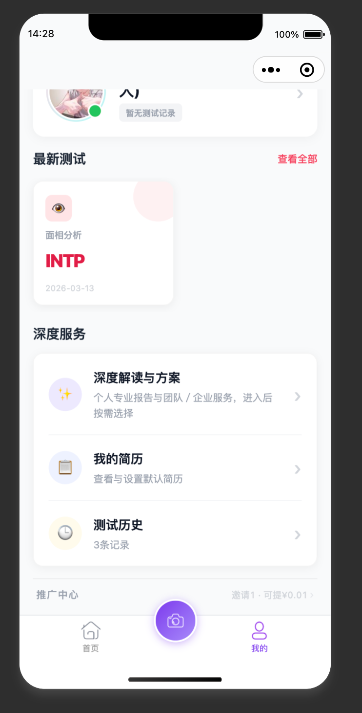

那个小程序后端的那个深度解析方案，这里就四个字，然后这四个字里面包括测试历史的话，就是放到最新测试旁边那个，查看全部这篇两个整合吊板，整个的那个页面直接整合起来。

那另外一方面的话，就小程序这里的用我们那个，这那个给埋点去统计数据的这一个功能植入整个小程序埋点和统计数据在后台也可以自在普通，那在那个大的超管后台，总的后台点击的这些数据槽管后台直接显示，那普通后台不显示。普通管理后台不显示，那直接把这个东西给它一下。

/Users/karuo/Documents/开发/3、自营项目/一场soul的创业实验-永平
然后参考一下那个一场创业实验的这个。参考一下一场创业实验这个 APP，把这个里面的小程序前端的那个30天锁定的这个功能，还用卡罗 AI 也同时去找那个整个的这一功能，把这个功能帮我清理一道。把这个功能迁移到这个项目里面来，嗯，这个这里面的这个纷乱的功能、统计的功能以及可以在这个项目里面可以应用上的功能，自己帮我清理到这个 NBTI 这个项目里面
