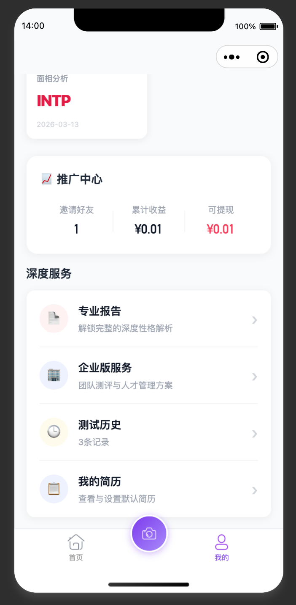

**全站测试报告（2026-03-27）**：管理端/API/小程序矩阵、已发现接口与数据类缺陷见 `开发文档/1、需求/修改/全站全链路测试与缺陷_20260327.md`（含截图目录 `开发文档/10、项目管理/测试记录/截图/20260327/`）。

---

bug一：
images/2026-03-27-13-55-34.png
images/2026-03-27-13-55-40.png
那个测试完之后，那个 NBTI 测试完之后没有跳出结果，帮我处理一下他们做一下丝滑一点的那个功能，这整个的体验界面做一个丝滑一些的，包括它的那些时间做一些测试，丝滑一点的那个转化

bug二：
images/2026-03-27-13-56-50.png
点击到1980的那个地方。点击到1980的198付款的那个位置的时候，就自动的不断的给我切到了那个完善个人资料这个地方有点问题直接帮我处理一下。完善完个人资料还是会来回跳。就是根本就用不了就对了

bug三：那其他的全面帮我把小程序的所有逻辑跟流程全部的帮我那个统计并且整理一下，然后把这个。拿过去一点点，包括每一按钮统计并且修复清楚。\

功能一：修复页面
然后这个深度服务的话，那个专业报告、企业服务这边合并在一起，那然后我的简历要我的简历那个也放到整个的那个深度服务，重新弄一下专业报告，跟企业服务合成，合并成一个标签，然后并且不要那么明显的一个收费的一个情况，然后这里面整个的我的页面做一些优化跟重构的一些事情。然后把这个东西给我整理一下，嗯。